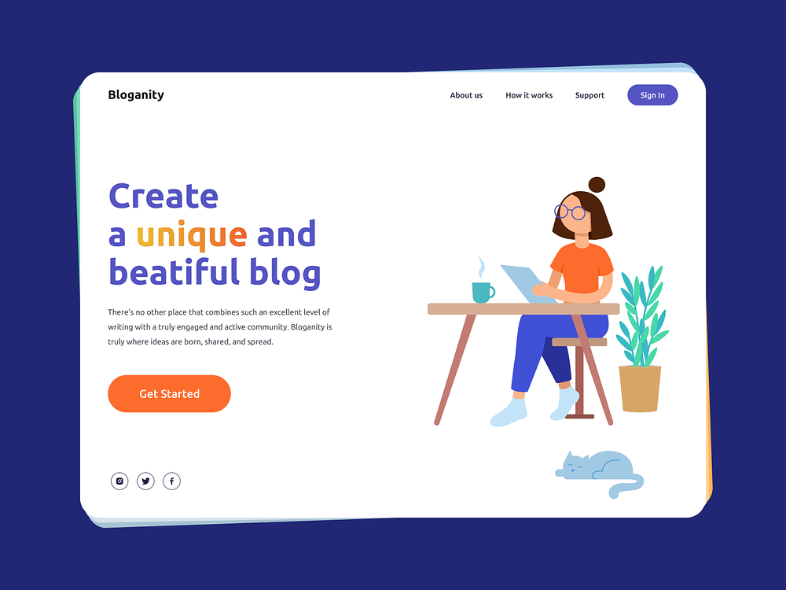

<h1 align="center">Bloganity</h1>

Desenvolvido por:
 Mislene Moura - [Linkedin](https://www.linkedin.com/in/mislene-silva-moura-1211531b4//) |
   [Github](https://github.com/MisleneSM)

## Índice

* [1. Resumo do projeto](#1-resumo-do-projeto)
* [2. Objetivos de aprendizagem](#2-objetivos-de-aprendizagem)
* [3. Resultado do Projeto](#3-resultado-do-projeto)
* [4. Tecnologias Utilizadas](#4-tecnologias-utilizadas)

***

## 1. Resumo do Projeto🤩

Desenvolvido um mini Blog, tendo como principal objetivo praticar meus conhecimentos em HTML e CSS. Site de referência do template: [Dribbble](https://dribbble.com/shots/15827768-Bloganity-Website-for-Blogging). Para acessar o projeto clique no [Link]()

## 2. Objetivos de aprendizagem✅

- HTML
- CSS

## 3. Resultado do Projeto📝

###### Template

###### Resultado Final

## 4. Tecnologias Utilizadas✅

  
